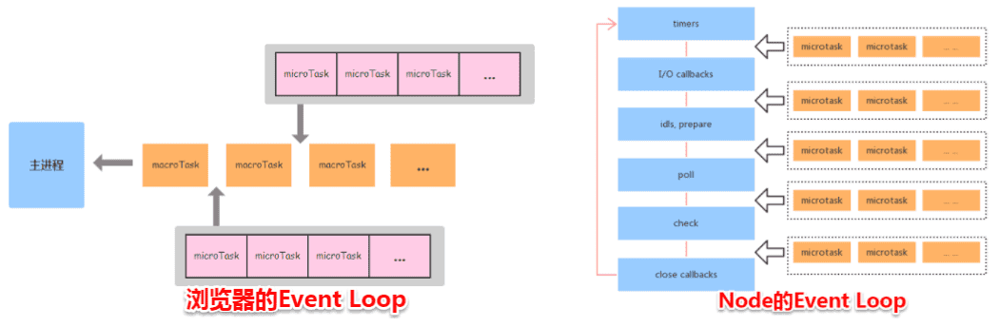

# node的事件循环

node的事件循环由libuv实现，与浏览器有些不一样，核心是提供i/o的事件循环主要分为6个阶段

1. timer阶段主要是setTimeout和setInterval
2. peddingcallback 上个循环中被延迟执行的回调函数
3. idle,prepare 仅内部使用
4. poll 执行i/o的callback，在适当的条件下会阻塞在这个阶段
5. check 执行setImmediate的callback
6. closeCallback 执行close事件的callback，例如socket.on('close'[,fn])、http.server.on('close, fn)

## poll阶段在执行i/o的回调

1. 如果pollqueue不为空，就会执行知道队列为空为止
2. 如果pollqueue为空，如果有setImmediate立即执行，如果没有

如果不在io的周期内执行，执行结果不一定

```js
// timeout_vs_immediate.js
setTimeout(() => {
  console.log('timeout');
}, 100);

setImmediate(() => {
  console.log('immediate');
});
```

```shell
$ node timeout_vs_immediate.js
timeout
immediate

$ node timeout_vs_immediate.js
immediate
timeout
```

在i/o的回调中总是setImmediate优先
```js
const fs = require('fs');
fs.readFile(__filename, () => {
  setTimeout(() => {
    console.log('timeout');
  }, 0);
  setImmediate(() => {
    console.log('immediate');
  });
});
```

```shell
$ node timeout_vs_immediate.js
immediate
timeout

$ node timeout_vs_immediate.js
immediate
timeout
```

## process.nextTick

这是一个微任务，会在每一个阶段执行完后，都会执行nextTickQueue里的回调，直到把这个队列清空为止

最后盗用一张图


浏览器的事件循环在一个宏任务执行完后执行，node在每一个阶段执行完后执行