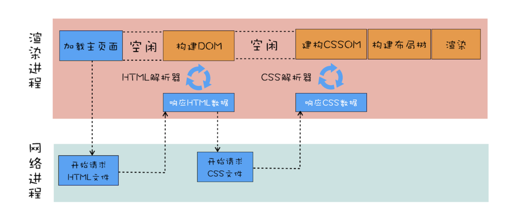

# 渲染过程

## dom树生成过程

浏览器接收http返回的html页面接收到的是字节流，我们最终看到是html页面，首先第一步我们需要将html字符串解析成dom树，浏览器有一个htmlParser的解析器，专门用来生成dom树

## htmlParser过程

浏览器不会等整个html页面都下载完成再解析，浏览器会接收到一些数据，就解析一些数据

1. 当浏览器收到响应头是`text/html`的文件，就会为这个页面单独创建一个渲染进程，网络进程和这个渲染进程之间会建立一个类似管道的东西，下载的数据会不断的传输给渲染进程，渲染进程接收到就解析。
2. 字节流转化为dom树需要有3个阶段 ，词法分析转化成token，生成节点Node，创建dom树。

### token处理阶段

浏览器解析过程会利用栈的数据结构，一个有三种类型的情况。

1. 开始标签，遇到开始标签将标签入栈，并捕获记录标签上的属性
2. 如果遇到文本标签，就将文本加入当前栈顶元素的文本属性
3. 如果遇到结束标签，从栈中取出元素，匹配是否能匹配上，如果匹配不上就报错，没问题就把匹配上的元素，设为当前栈顶元素的子元素。

### javascript对解析的影响

1. 如果是内联的js脚本,htmlParser会暂停html解析，去解析并执行script标签，解析完成再继续解析html

```html
<html>
<body>
    <div>1</div>
    <script>
    let div1 = document.getElementsByTagName('div')[0]
    div1.innerText = 'render'
    </script>
    <div>test</div>
</body>
</html>
```

2. 如果是引用的js脚本，因为js有可能更改dom，所以浏览器会去下载js，并执行js这两步都会阻止html的解析。这会造成渲染的白屏时间很长，浏览器有一个预解析线程来提前扫描字节流文件，提前下载js，css。
    1. async 异步加载js，加载完立即执行
    2. defer 异步加载js，在DOMContentLoaded执行之前执行

### css对解析的影响

html文档中如果存在外链的css，由于js可能会操作css，所以css还会阻塞js的解析，也就阻塞了html的解析



从图中可以看出当我们解析dom时最先解析的就是css文件，css也会生成类似dom树的cssom树，也要经过编译原理那一套

从上边可以看到解析css和js会是影响首次渲染白屏时间的主要因素，优化首屏渲染主要有以下几点

1. 使用内联的js和css来减少下载的等待，直接渲染
2. 如果需要外链需要压缩代码体积
3. 将与首次渲染无关的js分离出来，加上defer异步加载
4. 对于大的css文件，通过媒体文件拆分，在特定场合加载特定文件

#### DOMContentLoaded和onload的区别

1. DOMContentLoaded在主要文件js，css和html文档解析完毕后会执行
2. onload在页面中所有文件都下载完毕后执行

## css

我们知道渲染有几种方式，重排和重绘和合成，性能的消耗递减

1. 重排性能消耗最大，改变元素的位置，会引起重排，需要重新计算布局树，然后触发，重绘重新生成图层合成等
2. 改变文字，颜色等布局不会改变的属性会引起重绘，需要引起重新生成所有图层，然后合成等

### 分层和分块

分层类似与ps的图层概念，绘制一个复杂图形会生成多个图层再合并，合成完之后生成图像渲染到屏幕上